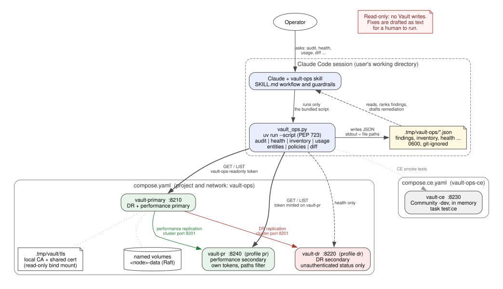

# vault-ops-skill

A read-only HashiCorp Vault operations skill for Claude Code. It audits a namespace tree, checks cluster health, inventories mounts and policies, reports client usage, and compares audit runs. All Vault access goes through one bundled script that only issues GET/LIST requests; Claude interprets the JSON it writes and drafts remediation as text for a human to run.

Check logic is ported from [nhsy-hcp/vault-tools](https://github.com/nhsy-hcp/vault-tools) `namespace-audit`.



The skill side (top) is all a user needs. The compose cluster (bottom) is this repo's dev and test environment. The source is [`docs/architecture.dot`](docs/architecture.dot); re-render it with `task docs:diagram`.

## Install (Claude Code plugin)

No Taskfile or repo checkout is needed. You need `uv` and network access to Vault.

```text
/plugin marketplace add nhsy-hcp/vault-ops-skill
/plugin install vault-ops@vault-ops-skill
```

Export the environment, then start Claude:

```bash
export VAULT_ADDR=https://vault.example.com:8200 VAULT_CACERT=/path/to/ca.pem
export VAULT_TOKEN="$(vault token create -policy=vault-ops-readonly -no-default-policy -orphan -ttl=1h -field=token)"
claude
```

| Variable | Required | Purpose |
| --- | --- | --- |
| `VAULT_ADDR`, `VAULT_TOKEN` | yes | Vault address and a token from [`vault-ops-readonly.hcl`](skills/vault-ops/policies/vault-ops-readonly.hcl) |
| `VAULT_CACERT` / `VAULT_SKIP_VERIFY` | recommended / dev only | TLS verification |
| `VAULT_NAMESPACE` | no | Start namespace for `audit`, `inventory`, `entities` |
| `VAULT_OPS_OUTPUT_DIR` | no | Results location (default `.tmp/vault-ops/` in the working directory, git-ignored) |

The other variables in `.env.template` (`VAULT_LICENSE`, `VAULT_IMAGE`, `VAULT_HOST_*`, `VAULT_DR_*`, `VAULT_PR_*`, `CONTAINER_CLI`) are only for this repo's local dev cluster. Setup details and safety notes: [skills/vault-ops/README.md](skills/vault-ops/README.md).

## Using the skill

With the plugin installed (or in this repo, where `.claude/skills/vault-ops` links to `skills/vault-ops`), ask, for example:

- "Audit my Vault" / "what's wrong with our namespaces?"
- "Is the cluster healthy? When does the license expire?"
- "Inventory namespaces and auth methods under tn001"
- "How many clients did we have this month?"
- "Show the entities and their aliases in tn001"
- "What changed since the last audit?"

The skill reports coverage gaps first, ranks and groups findings, and drafts remediation commands without running them.

### Script subcommands

```bash
uv run --script skills/vault-ops/scripts/vault_ops.py <command> [--output-dir DIR]   # default .tmp/vault-ops
```

| Command | Output | Notes |
| --- | --- | --- |
| `audit` | `{cluster}-findings-{ts}.json` + `{cluster}-inventory-{ts}.json` | `--namespace`, `-w/--workers`, `--no-sentinel`, `--redact-addr`, `--fail-on {medium,low,info}`, `--fail-on-gaps` |
| `health` | `{cluster}-health-{ts}.json` | seal, HA leader, raft peers and autopilot, version, license, DR and performance replication (peer heartbeat, canary age, clock skew, Merkle corruption, paths filters), lease ceilings, audit devices, automated snapshots, node metrics (`sys/metrics`) |
| `inventory` | `{cluster}-inventory-{ts}.json` | namespaces, non-built-in mounts, ACL policy **names**; summary has type distribution (mounts + namespaces per type), max depth, Sentinel counts by enforcement level and namespace `shapes` |
| `usage` | `{cluster}-usage-{ts}.json` | billing-period client counts plus `current_month`, and `activity_log` (whether Vault records client activity at all) |
| `entities` | `{cluster}-entities-{ts}.json` | per-namespace entity counts and findings; `--list` adds metadata, aliases and policies per entity |
| `policies` | `{cluster}-policies-{ts}.json` | ACL and Sentinel policy assessment (VT-POL-*, VT-SNT-*): per policy a body hash and flagged rules (path + capabilities), never the body; a `sentinel` block with EGP/RGP names, enforcement levels, EGP paths, imports and hashes, never the source. `--no-sentinel` skips Sentinel. ACL bodies need the `vault-ops-policy-reader` add-on and Sentinel bodies `vault-ops-sentinel-reader`; without them every body is a coverage denial |
| `diff OLD NEW` | `diff-{ts}.json` | new / resolved / unchanged findings by fingerprint |

Environment: `VAULT_ADDR`, `VAULT_TOKEN`, `VAULT_NAMESPACE`, `VAULT_SKIP_VERIFY`, `VAULT_CACERT`, `VAULT_OPS_OUTPUT_DIR`. Files are written 0600; stdout carries only their paths.

### Rules

| Rule | Severity | Checks |
| --- | --- | --- |
| VT-MOUNT-001 | medium | Plugin deprecated / pending removal |
| VT-AUTH-001 | low | Auth mount listed to unauthenticated callers |
| VT-MOUNT-002 | low | Mount max lease TTL above the cluster ceiling |
| VT-MOUNT-003 | info | Local (non-replicated) mount |
| VT-MOUNT-004 | low | Mount default lease TTL above 768h |
| VT-MOUNT-005 | info | More than 20 mounts of one type in a namespace |
| VT-MOUNT-006 | info | KV version 1 mount |
| VT-NS-001 | info | Namespace with no auth beyond token |
| VT-NS-002 | info | Unused leaf namespace |
| VT-SNT-001..007 | medium/low/info | Sentinel advisory, soft-mandatory, wildcard EGP, always-true (from `audit` and `policies`); drifted copies across namespaces, hard-mandatory always-false, `http` import (from `policies`). All need the `vault-ops-sentinel-reader` add-on |
| VT-LIC-001 | medium | License expires within 90 days |
| VT-LEASE-001 | low | Cluster default lease TTL above 768h |
| VT-HLTH-001..006 | medium/low/info | Sealed / no leader, unhealthy replication, unsupported version, raft autopilot unhealthy, irrevocable leases, lease count above 100k (from the queried node's `sys/metrics`) |
| VT-REPL-001..005 | high/medium/low/info | Replication lag (canary age, stale heartbeat), known secondary with no heartbeat (never connected, or down since the primary restarted), clock skew, corrupted Merkle tree, performance paths filter in use (from `health`) |
| VT-AUD-001..003 | medium/low | No audit device, only one audit device, device logging raw values or unhashed accessors |
| VT-SNAP-001..003 | medium/info | No automated Raft snapshots (Enterprise), snapshot failing or overdue, snapshots on the node's local disk |
| VT-ID-001..003 | low/info | Entity without aliases, policies attached directly to an entity, disabled entity |
| VT-ID-004..005 | low | Far more entities than active clients, alias name shared by several entities |
| VT-POL-001..005 | medium/low/info | ACL policy with write or sudo on every path, policy that can change access control (policies, auth, mounts, tokens, identity), sudo, same-named policy drifted across namespaces, unparseable policy (from `policies`) |
| VT-CLI-001..005 | low/info | Token-only client sprawl, sharp client growth, mount creating new clients every month, most clients in root, activity log disabled so counts aren't recorded (from `usage`) |

Details and remediation: [`references/rules.md`](skills/vault-ops/references/rules.md). Schema: [`findings.schema.json`](skills/vault-ops/schemas/findings.schema.json).

### Least-privilege token

```bash
vault policy write vault-ops-readonly skills/vault-ops/policies/vault-ops-readonly.hcl
vault token create -policy=vault-ops-readonly -no-default-policy -orphan -ttl=1h -explicit-max-ttl=1h
```

The policy is read/list only and never grants reading ACL or Sentinel policy bodies. For a policy review with `policies`, an admin also loads `skills/vault-ops/policies/vault-ops-policy-reader.hcl` (`read` on `sys/policies/acl/*` per namespace level, no `list` or `sudo`) and adds `-policy=vault-ops-policy-reader` to the token; the script parses bodies in memory and writes only names, hashes and flagged rules. Sentinel checks (VT-SNT-*, in `audit` and `policies`) likewise need `skills/vault-ops/policies/vault-ops-sentinel-reader.hcl` (`read` on `sys/policies/{egp,rgp}/*`) and `-policy=vault-ops-sentinel-reader`; Sentinel source is never written. The two exact list paths, `sys/audit` and `sys/storage/raft/snapshot-auto/config`, also get `sudo` because Vault protects them; neither grants writes, and snapshot configs (which hold storage credentials) stay unreadable.

## Local development

### Prerequisites

| Tool | Used for |
| --- | --- |
| [task](https://taskfile.dev) | Every dev workflow (`Taskfile.yml`) |
| [uv](https://docs.astral.sh/uv/) | Python deps, running the skill script and tests |
| Docker **or** podman, plus Compose v2 (`docker compose`) | The Vault nodes in `compose.yaml` and the CE server in `compose.ce.yaml` |
| `vault` CLI (any edition) | Init, unseal, replication setup, tokens. It is only a client: the servers run in containers |
| `jq`, `curl`, `openssl` | Health polling, status output, the local CA and TLS certs |
| `gitleaks`, `shellcheck`, `pre-commit` | `task lint` |
| [Graphviz](https://graphviz.org) `dot` (optional) | `task docs:diagram`: re-render `docs/architecture.svg` after editing `docs/architecture.dot` |
| Vault Enterprise licence with DR and performance replication (`multi-dc-scale`) | `VAULT_LICENSE` in `.env`. Not needed for `task test`, `task test:ce` or CI |

`task deps` checks all of these, plus that the container engine is reachable and ports 8210, 8220 and 8240 are free.

### Podman notes

This repo is developed on podman behind the `docker` CLI (`CONTAINER_CLI=docker` in `.env`). Plain Docker works unchanged.

- **`docker` is a shim.** podman's macOS installer adds `/usr/local/bin/docker`, which runs `exec podman "$@"`. It prints `Emulate Docker CLI using podman` on every call; `sudo touch /etc/containers/nodocker` silences it.
- **Start the VM first:** `podman machine start`. Otherwise `task deps` fails with `Cannot connect to Podman`.
- **Compose:** `docker compose` becomes `podman compose`, which delegates to an external provider: `docker-compose` (Compose v2, e.g. `brew install docker-compose`) or `podman-compose`. The tasks use `up --wait`, healthchecks and `configs:`, so use `docker-compose` v2.
- **Image names** are fully qualified (`docker.io/hashicorp/...`) because podman has no default registry.
- **Capabilities:** Vault 2.x needs `IPC_LOCK` and `SETFCAP` (set in both compose files).
- **act** (to run the CI workflow locally) needs the podman socket. See [docs/testing.md](docs/testing.md).

### Workflow

```bash
task init && task deps    # one-time setup, then validate the environment
task up:all               # primary :8210, DR :8220, performance secondary :8240 (compose, raft, TLS)
task dr:enable && task pr:enable   # replication primary -> secondaries (before seeding)
task seed && task seed:findings && task token:policies && task token:pr
task skill:run -- audit   # run the skill script with the read-only token (skill:run:pr for vault-pr)
task test:all && task lint
task test:e2e             # everything above from scratch (destructive: wipes .tmp/vault)
```

- CI: [`.github/workflows/ci.yml`](.github/workflows/ci.yml) runs `task test:ci` as two jobs, `lint` then `test-ci` (plugin manifests, unit tests), on pushes to `main` and on pull requests. It needs no Vault, licence or secrets. Run it locally with `act`.
- Skill evals: `task eval` runs the [`claude plugin eval`](evals/) suite: thirteen offline cases that check the skill triggers (and doesn't on Terraform authoring), interprets saved findings, compares two runs, flags partial coverage, explains DR-secondary, sealed-node and performance-secondary health, reviews ACL and Sentinel policies (with and without the reader add-ons), keeps entity details private, refuses to change Vault and never reads `.env` for a token. Each case also runs a no-plugin baseline arm. It needs no Vault, but uses API credits (about $8 for the default 3 runs; `task eval -- --case <name> --runs 1` while iterating, since an extra `--tag` widens the filter rather than narrowing it). Results go to `evals/results/` (gitignored). It is not part of CI.
- Compose setup, DR and performance replication, failure drills: [docs/replication.md](docs/replication.md). Manual test walkthrough: [docs/testing.md](docs/testing.md)
- All tasks and repo conventions: [AGENTS.md](AGENTS.md)

License: [MPL-2.0](LICENSE).
